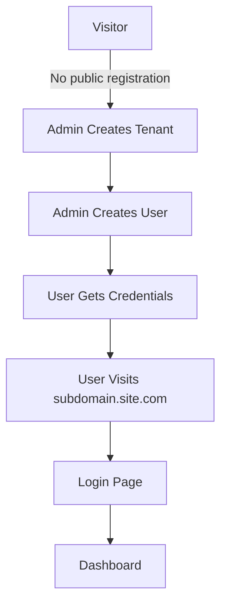
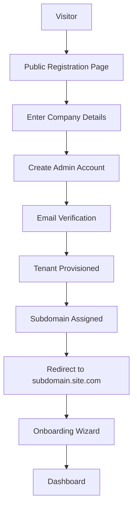
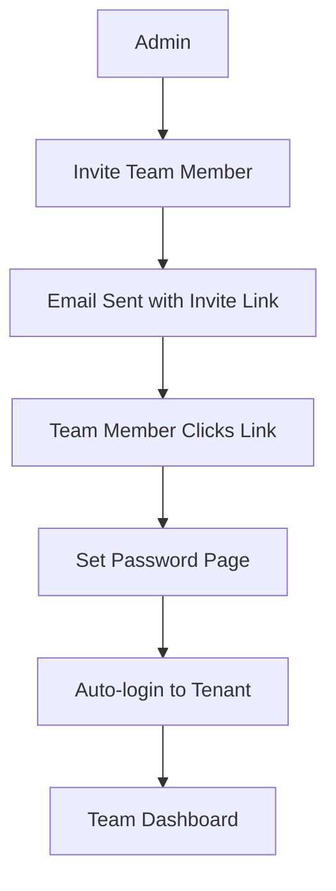

# CollaborInbox Multi-Tenant Architecture Analysis

**Date:** 2025-07-09  
**Analyst:** CodeRabbit-style Security & Architecture Review  
**Version:** 1.0

## Executive Summary

CollaborInbox implements a subdomain-based multi-tenant architecture using the `stancl/tenancy` package. While the core implementation appears functional, there are several critical security vulnerabilities, architectural inconsistencies, and missing features that need to be addressed before production deployment.

### Key Findings:
- ✅ Core multi-tenancy infrastructure is in place
- ❌ No public tenant registration system
- ❌ Critical security vulnerabilities in tenant isolation
- ⚠️ Incomplete user flow implementation
- ⚠️ Missing proper tenant onboarding process

## 1. Architecture Overview

### 1.1 Current Implementation

The system uses:
- **Subdomain-based tenant identification** (e.g., `acme.collaborinbox.test`)
- **Shared database with tenant_id scoping** (not database-per-tenant)
- **stancl/tenancy package** for core functionality
- **BelongsToTenant trait** for automatic query scoping

### 1.2 Key Components

```
┌─────────────────────────────────────────────────────────────┐
│                     Request Flow                             │
├─────────────────────────────────────────────────────────────┤
│  1. HTTP Request → subdomain.collaborinbox.test             │
│  2. RouteServiceProvider → Determines route type            │
│  3. InitializeTenancyByDomain → Identifies tenant           │
│  4. SetTenantMiddleware → Sets tenant context              │
│  5. BelongsToTenant → Auto-scopes queries                  │
└─────────────────────────────────────────────────────────────┘
```

## 2. Security Analysis

### 2.1 Critical Security Issues

#### Issue 1: Unrestricted Tenant Creation Endpoint
**Severity:** 🔴 CRITICAL
```php
// routes/web.php:249
Route::get('/create-test-tenant', function () {
    // Anyone can create a tenant without authentication!
```
**Risk:** Allows unauthorized users to create unlimited tenants, leading to:
- Database pollution
- Resource exhaustion attacks
- Potential data exposure

#### Issue 2: Dangerous Query Methods in BelongsToTenant
**Severity:** 🔴 CRITICAL
```php
// app/Traits/BelongsToTenant.php:53
public static function createWithoutTenancy(array $attributes = [])
public static function allTenants(): Builder
```
**Risk:** These methods bypass tenant isolation completely. If misused:
- Cross-tenant data exposure
- Data manipulation across tenants
- Complete breach of multi-tenant security

#### Issue 3: Missing Authentication on Test Routes
**Severity:** 🟡 HIGH
```php
// Multiple test endpoints without auth middleware
Route::get('/tenants/list', function () {
    $tenants = \App\Models\Tenant::all();
```
**Risk:** Exposes sensitive tenant information publicly

### 2.2 Authentication & Authorization Issues

#### Issue 4: No Tenant Validation in User Authentication
**Severity:** 🟡 HIGH
```php
// routes/web.php:512
if (Auth::attempt($credentials, $remember)) {
    // No check if user belongs to current tenant!
```
**Risk:** Users from one tenant can potentially log into another tenant's subdomain

#### Issue 5: Missing Role/Permission Validation
**Severity:** 🟠 MEDIUM
- RBAC system exists but isn't enforced in tenant routes
- No middleware to check permissions on sensitive operations

### 2.3 Data Isolation Concerns

#### Issue 6: Inconsistent Tenant Scoping
**Severity:** 🟡 HIGH
```php
// MailboxConfiguration model doesn't use BelongsToTenant trait
// Located in app/Models/Tenant/ but missing trait
```
**Risk:** Potential for cross-tenant data leakage in email configurations

## 3. User Flow Analysis

### 3.1 Current User Journey



### 3.2 Missing Components

1. **No Public Tenant Registration**
   - No signup page for new companies
   - No self-service onboarding
   - Manual admin intervention required

2. **No Tenant Admin Self-Management**
   - First admin user must be created manually
   - No invite system for team members
   - No billing/subscription integration

3. **No Tenant Provisioning Workflow**
   - Database creation is referenced but not implemented
   - No automated setup process
   - No welcome emails or onboarding

## 4. Technical Issues

### 4.1 Routing Problems

#### Issue 7: Conflicting Route Definitions
```php
// Both central and tenant routes have overlapping paths
Route::get('/dashboard', ...) // In both web.php and tenant.php
```
**Impact:** Unpredictable behavior, potential security issues

### 4.2 Database Structure

#### Issue 8: Incomplete Tenant Isolation
- Using shared database with tenant_id
- But TenancyServiceProvider suggests database-per-tenant setup
- Inconsistent implementation

### 4.3 Frontend Integration

#### Issue 9: No Tenant Context in Frontend
- Vue.js components don't have tenant awareness
- WebSocket channels aren't properly tenant-scoped
- Potential for real-time data leakage

## 5. Improvement Recommendations

### 5.1 Immediate Security Fixes (Priority 1)

1. **Remove all test/debug routes** from production
   ```php
   // Add to all test routes
   if (!app()->environment('local')) {
       abort(404);
   }
   ```

2. **Add tenant validation to login**
   ```php
   // In login logic
   $user = User::where('email', $email)->first();
   if ($user && $user->tenant_id !== tenant()->id) {
       return error('Invalid credentials');
   }
   ```

3. **Restrict dangerous methods**
   ```php
   // Add to BelongsToTenant trait
   if (!auth()->user()?->isSuperAdmin()) {
       throw new UnauthorizedException();
   }
   ```

### 5.2 Architecture Improvements (Priority 2)

1. **Implement proper tenant registration flow**
   - Public registration page
   - Email verification
   - Automatic tenant provisioning
   - First admin user creation

2. **Add middleware stack**
   ```php
   Route::middleware(['auth', 'tenant', 'verified', 'active.tenant'])
   ```

3. **Implement tenant status checks**
   - Active/inactive/suspended states
   - Billing status integration
   - Resource limits

### 5.3 User Experience Enhancements (Priority 3)

1. **Tenant onboarding wizard**
   - Company profile setup
   - Email configuration
   - Team member invites
   - Feature tour

2. **Tenant switching for super admins**
   - Impersonation capabilities
   - Audit logging
   - Clear visual indicators

## 6. Proposed User Flow

### 6.1 Tenant Registration Flow



### 6.2 Team Member Flow



## 7. Implementation Checklist

### Phase 1: Security Hardening (Week 1)
- [ ] Remove all debug/test routes
- [ ] Add tenant validation to authentication
- [ ] Implement permission checks on all routes
- [ ] Add rate limiting to prevent abuse
- [ ] Audit and fix all models for tenant scoping

### Phase 2: Core Features (Week 2-3)
- [ ] Build tenant registration system
- [ ] Create tenant provisioning workflow
- [ ] Implement team invitation system
- [ ] Add tenant management dashboard
- [ ] Create billing integration hooks

### Phase 3: Polish & Scale (Week 4)
- [ ] Add comprehensive logging
- [ ] Implement tenant resource limits
- [ ] Create admin super-panel
- [ ] Add tenant backup/export features
- [ ] Performance optimization

## 8. Testing Requirements

### 8.1 Security Tests
```php
// Test cross-tenant data access
test('user_cannot_access_other_tenant_data')
test('tenant_scoping_applies_to_all_models')
test('super_admin_can_access_all_tenants')
```

### 8.2 Functional Tests
```php
// Test tenant lifecycle
test('can_register_new_tenant')
test('can_provision_tenant_resources')
test('can_invite_team_members')
test('can_switch_between_tenants')
```

## 9. Monitoring & Maintenance

### 9.1 Key Metrics to Track
- Tenant creation rate
- Failed login attempts per tenant
- Cross-tenant access attempts (security)
- Resource usage per tenant
- API calls per tenant

### 9.2 Alerts to Configure
- Suspicious cross-tenant access patterns
- Unusual tenant creation spikes
- Failed tenant provisioning
- Tenant resource limit exceeded

## 10. Conclusion

The CollaborInbox multi-tenant architecture has a solid foundation but requires significant security hardening and feature completion before production use. The most critical issues are:

1. **Security vulnerabilities** that could lead to data breaches
2. **Missing user registration flow** preventing self-service
3. **Incomplete tenant isolation** in some models

With the recommended improvements, the system can become a robust, secure multi-tenant SaaS platform. The estimated timeline for full implementation is 4-6 weeks with a dedicated team.

## Appendix A: Code Examples

### Secure Tenant Registration Controller
```php
class TenantRegistrationController extends Controller
{
    public function store(RegisterTenantRequest $request)
    {
        DB::transaction(function () use ($request) {
            // Create tenant
            $tenant = Tenant::create([
                'name' => $request->company_name,
                'domain' => $request->subdomain,
            ]);
            
            // Create domain
            $tenant->domains()->create([
                'domain' => $request->subdomain . '.' . config('app.base_domain'),
            ]);
            
            // Create admin user
            $admin = User::create([
                'name' => $request->admin_name,
                'email' => $request->admin_email,
                'password' => Hash::make($request->password),
                'tenant_id' => $tenant->id,
                'email_verified_at' => null,
            ]);
            
            // Assign admin role
            $admin->assignRole('admin');
            
            // Send verification email
            $admin->sendEmailVerificationNotification();
            
            // Dispatch tenant setup job
            TenantSetupJob::dispatch($tenant);
        });
    }
}
```

### Secure Authentication with Tenant Validation
```php
class TenantAwareLoginController extends Controller
{
    public function login(Request $request)
    {
        $credentials = $request->validate([
            'email' => 'required|email',
            'password' => 'required',
        ]);
        
        // Find user
        $user = User::where('email', $credentials['email'])->first();
        
        // Validate tenant context
        if (!$user || !tenant() || $user->tenant_id !== tenant()->id) {
            throw ValidationException::withMessages([
                'email' => 'Invalid credentials for this organization.',
            ]);
        }
        
        // Attempt login
        if (!Auth::attempt($credentials)) {
            throw ValidationException::withMessages([
                'email' => 'Invalid credentials.',
            ]);
        }
        
        return redirect()->intended(route('dashboard'));
    }
}
```

---

*This analysis should be reviewed and updated as the implementation progresses.*
